ol.lst-kix\_1h1v33m4av34-5.start{counter-reset:lst-ctn-kix\_1h1v33m4av34-5 0}.lst-kix\_mnyjudcm0q5c-1>li{counter-increment:lst-ctn-kix\_mnyjudcm0q5c-1}.lst-kix\_71jqdag4c0g7-0>li{counter-increment:lst-ctn-kix\_71jqdag4c0g7-0}ol.lst-kix\_1h1v33m4av34-2.start{counter-reset:lst-ctn-kix\_1h1v33m4av34-2 0}.lst-kix\_1h1v33m4av34-1>li{counter-increment:lst-ctn-kix\_1h1v33m4av34-1}ol.lst-kix\_jowsy9scra86-2.start{counter-reset:lst-ctn-kix\_jowsy9scra86-2 0}.lst-kix\_mnyjudcm0q5c-2>li{counter-increment:lst-ctn-kix\_mnyjudcm0q5c-2}.lst-kix\_1h1v33m4av34-0>li{counter-increment:lst-ctn-kix\_1h1v33m4av34-0}ol.lst-kix\_mnyjudcm0q5c-6.start{counter-reset:lst-ctn-kix\_mnyjudcm0q5c-6 0}ol.lst-kix\_jowsy9scra86-5.start{counter-reset:lst-ctn-kix\_jowsy9scra86-5 0}.lst-kix\_71jqdag4c0g7-0>li:before{content:"" counter(lst-ctn-kix\_71jqdag4c0g7-0,decimal) ". "}.lst-kix\_71jqdag4c0g7-1>li:before{content:"\\0025cb "}ol.lst-kix\_mnyjudcm0q5c-3.start{counter-reset:lst-ctn-kix\_mnyjudcm0q5c-3 0}ol.lst-kix\_71jqdag4c0g7-4.start{counter-reset:lst-ctn-kix\_71jqdag4c0g7-4 0}ol.lst-kix\_mnyjudcm0q5c-2{list-style-type:none}.lst-kix\_1h1v33m4av34-3>li:before{content:"" counter(lst-ctn-kix\_1h1v33m4av34-3,decimal) ". "}ol.lst-kix\_mnyjudcm0q5c-1{list-style-type:none}ol.lst-kix\_mnyjudcm0q5c-4{list-style-type:none}.lst-kix\_1h1v33m4av34-2>li:before{content:"" counter(lst-ctn-kix\_1h1v33m4av34-2,lower-roman) ". "}.lst-kix\_1h1v33m4av34-4>li:before{content:"" counter(lst-ctn-kix\_1h1v33m4av34-4,lower-latin) ". "}ol.lst-kix\_mnyjudcm0q5c-3{list-style-type:none}ol.lst-kix\_1h1v33m4av34-8.start{counter-reset:lst-ctn-kix\_1h1v33m4av34-8 0}ol.lst-kix\_mnyjudcm0q5c-0{list-style-type:none}ol.lst-kix\_mnyjudcm0q5c-0.start{counter-reset:lst-ctn-kix\_mnyjudcm0q5c-0 0}ol.lst-kix\_71jqdag4c0g7-7.start{counter-reset:lst-ctn-kix\_71jqdag4c0g7-7 0}.lst-kix\_1h1v33m4av34-0>li:before{content:"" counter(lst-ctn-kix\_1h1v33m4av34-0,decimal) ". "}.lst-kix\_mnyjudcm0q5c-3>li{counter-increment:lst-ctn-kix\_mnyjudcm0q5c-3}ol.lst-kix\_mnyjudcm0q5c-6{list-style-type:none}.lst-kix\_1h1v33m4av34-1>li:before{content:"" counter(lst-ctn-kix\_1h1v33m4av34-1,lower-latin) ". "}.lst-kix\_mnyjudcm0q5c-0>li{counter-increment:lst-ctn-kix\_mnyjudcm0q5c-0}ol.lst-kix\_mnyjudcm0q5c-5{list-style-type:none}ol.lst-kix\_mnyjudcm0q5c-8{list-style-type:none}ol.lst-kix\_mnyjudcm0q5c-7{list-style-type:none}.lst-kix\_jowsy9scra86-8>li{counter-increment:lst-ctn-kix\_jowsy9scra86-8}ol.lst-kix\_1h1v33m4av34-6{list-style-type:none}ol.lst-kix\_1h1v33m4av34-7{list-style-type:none}ol.lst-kix\_1h1v33m4av34-8{list-style-type:none}.lst-kix\_71jqdag4c0g7-2>li{counter-increment:lst-ctn-kix\_71jqdag4c0g7-2}ol.lst-kix\_1h1v33m4av34-2{list-style-type:none}ol.lst-kix\_1h1v33m4av34-3{list-style-type:none}ol.lst-kix\_1h1v33m4av34-4{list-style-type:none}ol.lst-kix\_1h1v33m4av34-5{list-style-type:none}ol.lst-kix\_71jqdag4c0g7-0.start{counter-reset:lst-ctn-kix\_71jqdag4c0g7-0 0}.lst-kix\_71jqdag4c0g7-8>li{counter-increment:lst-ctn-kix\_71jqdag4c0g7-8}ol.lst-kix\_1h1v33m4av34-0{list-style-type:none}ol.lst-kix\_1h1v33m4av34-1{list-style-type:none}ol.lst-kix\_mnyjudcm0q5c-1.start{counter-reset:lst-ctn-kix\_mnyjudcm0q5c-1 0}.lst-kix\_mnyjudcm0q5c-5>li{counter-increment:lst-ctn-kix\_mnyjudcm0q5c-5}.lst-kix\_71jqdag4c0g7-7>li:before{content:"" counter(lst-ctn-kix\_71jqdag4c0g7-7,lower-latin) ". "}ol.lst-kix\_71jqdag4c0g7-8{list-style-type:none}ol.lst-kix\_71jqdag4c0g7-7{list-style-type:none}.lst-kix\_71jqdag4c0g7-6>li:before{content:"" counter(lst-ctn-kix\_71jqdag4c0g7-6,decimal) ". "}.lst-kix\_71jqdag4c0g7-5>li:before{content:"" counter(lst-ctn-kix\_71jqdag4c0g7-5,lower-roman) ". "}ol.lst-kix\_71jqdag4c0g7-0{list-style-type:none}.lst-kix\_71jqdag4c0g7-3>li:before{content:"" counter(lst-ctn-kix\_71jqdag4c0g7-3,decimal) ". "}ol.lst-kix\_71jqdag4c0g7-6.start{counter-reset:lst-ctn-kix\_71jqdag4c0g7-6 0}.lst-kix\_71jqdag4c0g7-2>li:before{content:"" counter(lst-ctn-kix\_71jqdag4c0g7-2,lower-roman) ". "}ol.lst-kix\_71jqdag4c0g7-2{list-style-type:none}.lst-kix\_71jqdag4c0g7-4>li:before{content:"" counter(lst-ctn-kix\_71jqdag4c0g7-4,lower-latin) ". "}.lst-kix\_71jqdag4c0g7-7>li{counter-increment:lst-ctn-kix\_71jqdag4c0g7-7}ol.lst-kix\_71jqdag4c0g7-4{list-style-type:none}ol.lst-kix\_71jqdag4c0g7-3{list-style-type:none}ol.lst-kix\_71jqdag4c0g7-6{list-style-type:none}ol.lst-kix\_71jqdag4c0g7-5{list-style-type:none}.lst-kix\_jowsy9scra86-1>li{counter-increment:lst-ctn-kix\_jowsy9scra86-1}.lst-kix\_1h1v33m4av34-8>li{counter-increment:lst-ctn-kix\_1h1v33m4av34-8}ol.lst-kix\_jowsy9scra86-4.start{counter-reset:lst-ctn-kix\_jowsy9scra86-4 0}ol.lst-kix\_mnyjudcm0q5c-8.start{counter-reset:lst-ctn-kix\_mnyjudcm0q5c-8 0}.lst-kix\_jowsy9scra86-7>li{counter-increment:lst-ctn-kix\_jowsy9scra86-7}.lst-kix\_jowsy9scra86-4>li{counter-increment:lst-ctn-kix\_jowsy9scra86-4}.lst-kix\_71jqdag4c0g7-8>li:before{content:"" counter(lst-ctn-kix\_71jqdag4c0g7-8,lower-roman) ". "}ul.lst-kix\_71jqdag4c0g7-1{list-style-type:none}ol.lst-kix\_mnyjudcm0q5c-2.start{counter-reset:lst-ctn-kix\_mnyjudcm0q5c-2 0}ol.lst-kix\_1h1v33m4av34-3.start{counter-reset:lst-ctn-kix\_1h1v33m4av34-3 0}.lst-kix\_1h1v33m4av34-5>li{counter-increment:lst-ctn-kix\_1h1v33m4av34-5}.lst-kix\_1h1v33m4av34-2>li{counter-increment:lst-ctn-kix\_1h1v33m4av34-2}ol.lst-kix\_71jqdag4c0g7-5.start{counter-reset:lst-ctn-kix\_71jqdag4c0g7-5 0}.lst-kix\_71jqdag4c0g7-5>li{counter-increment:lst-ctn-kix\_71jqdag4c0g7-5}.lst-kix\_mnyjudcm0q5c-7>li{counter-increment:lst-ctn-kix\_mnyjudcm0q5c-7}ol.lst-kix\_71jqdag4c0g7-8.start{counter-reset:lst-ctn-kix\_71jqdag4c0g7-8 0}.lst-kix\_1h1v33m4av34-6>li{counter-increment:lst-ctn-kix\_1h1v33m4av34-6}.lst-kix\_1h1v33m4av34-7>li{counter-increment:lst-ctn-kix\_1h1v33m4av34-7}.lst-kix\_71jqdag4c0g7-4>li{counter-increment:lst-ctn-kix\_71jqdag4c0g7-4}.lst-kix\_jowsy9scra86-3>li{counter-increment:lst-ctn-kix\_jowsy9scra86-3}.lst-kix\_mnyjudcm0q5c-8>li{counter-increment:lst-ctn-kix\_mnyjudcm0q5c-8}ol.lst-kix\_jowsy9scra86-6.start{counter-reset:lst-ctn-kix\_jowsy9scra86-6 0}.lst-kix\_mnyjudcm0q5c-6>li{counter-increment:lst-ctn-kix\_mnyjudcm0q5c-6}ol.lst-kix\_jowsy9scra86-0{list-style-type:none}ol.lst-kix\_jowsy9scra86-1{list-style-type:none}ol.lst-kix\_jowsy9scra86-2{list-style-type:none}ol.lst-kix\_jowsy9scra86-3{list-style-type:none}ol.lst-kix\_jowsy9scra86-4{list-style-type:none}ol.lst-kix\_jowsy9scra86-5{list-style-type:none}ol.lst-kix\_jowsy9scra86-6{list-style-type:none}ol.lst-kix\_1h1v33m4av34-4.start{counter-reset:lst-ctn-kix\_1h1v33m4av34-4 0}ol.lst-kix\_jowsy9scra86-7{list-style-type:none}ol.lst-kix\_jowsy9scra86-8{list-style-type:none}.lst-kix\_mnyjudcm0q5c-6>li:before{content:"" counter(lst-ctn-kix\_mnyjudcm0q5c-6,decimal) ". "}ol.lst-kix\_jowsy9scra86-3.start{counter-reset:lst-ctn-kix\_jowsy9scra86-3 0}ol.lst-kix\_mnyjudcm0q5c-7.start{counter-reset:lst-ctn-kix\_mnyjudcm0q5c-7 0}.lst-kix\_mnyjudcm0q5c-7>li:before{content:"" counter(lst-ctn-kix\_mnyjudcm0q5c-7,lower-latin) ". "}.lst-kix\_mnyjudcm0q5c-8>li:before{content:"" counter(lst-ctn-kix\_mnyjudcm0q5c-8,lower-roman) ". "}ol.lst-kix\_1h1v33m4av34-1.start{counter-reset:lst-ctn-kix\_1h1v33m4av34-1 0}.lst-kix\_jowsy9scra86-2>li{counter-increment:lst-ctn-kix\_jowsy9scra86-2}.lst-kix\_jowsy9scra86-5>li{counter-increment:lst-ctn-kix\_jowsy9scra86-5}ol.lst-kix\_mnyjudcm0q5c-4.start{counter-reset:lst-ctn-kix\_mnyjudcm0q5c-4 0}.lst-kix\_mnyjudcm0q5c-0>li:before{content:"" counter(lst-ctn-kix\_mnyjudcm0q5c-0,decimal) ". "}ol.lst-kix\_jowsy9scra86-0.start{counter-reset:lst-ctn-kix\_jowsy9scra86-0 0}ol.lst-kix\_71jqdag4c0g7-3.start{counter-reset:lst-ctn-kix\_71jqdag4c0g7-3 0}ol.lst-kix\_1h1v33m4av34-0.start{counter-reset:lst-ctn-kix\_1h1v33m4av34-0 0}.lst-kix\_1h1v33m4av34-3>li{counter-increment:lst-ctn-kix\_1h1v33m4av34-3}.lst-kix\_1h1v33m4av34-6>li:before{content:"" counter(lst-ctn-kix\_1h1v33m4av34-6,decimal) ". "}ol.lst-kix\_jowsy9scra86-7.start{counter-reset:lst-ctn-kix\_jowsy9scra86-7 0}.lst-kix\_1h1v33m4av34-5>li:before{content:"" counter(lst-ctn-kix\_1h1v33m4av34-5,lower-roman) ". "}.lst-kix\_mnyjudcm0q5c-4>li{counter-increment:lst-ctn-kix\_mnyjudcm0q5c-4}.lst-kix\_1h1v33m4av34-4>li{counter-increment:lst-ctn-kix\_1h1v33m4av34-4}.lst-kix\_mnyjudcm0q5c-5>li:before{content:"" counter(lst-ctn-kix\_mnyjudcm0q5c-5,lower-roman) ". "}.lst-kix\_jowsy9scra86-8>li:before{content:"" counter(lst-ctn-kix\_jowsy9scra86-8,lower-roman) ". "}.lst-kix\_jowsy9scra86-7>li:before{content:"" counter(lst-ctn-kix\_jowsy9scra86-7,lower-latin) ". "}.lst-kix\_mnyjudcm0q5c-3>li:before{content:"" counter(lst-ctn-kix\_mnyjudcm0q5c-3,decimal) ". "}.lst-kix\_mnyjudcm0q5c-4>li:before{content:"" counter(lst-ctn-kix\_mnyjudcm0q5c-4,lower-latin) ". "}.lst-kix\_jowsy9scra86-6>li{counter-increment:lst-ctn-kix\_jowsy9scra86-6}.lst-kix\_1h1v33m4av34-7>li:before{content:"" counter(lst-ctn-kix\_1h1v33m4av34-7,lower-latin) ". "}.lst-kix\_mnyjudcm0q5c-1>li:before{content:"" counter(lst-ctn-kix\_mnyjudcm0q5c-1,lower-latin) ". "}.lst-kix\_mnyjudcm0q5c-2>li:before{content:"" counter(lst-ctn-kix\_mnyjudcm0q5c-2,lower-roman) ". "}ol.lst-kix\_1h1v33m4av34-7.start{counter-reset:lst-ctn-kix\_1h1v33m4av34-7 0}.lst-kix\_1h1v33m4av34-8>li:before{content:"" counter(lst-ctn-kix\_1h1v33m4av34-8,lower-roman) ". "}.lst-kix\_jowsy9scra86-0>li{counter-increment:lst-ctn-kix\_jowsy9scra86-0}.lst-kix\_jowsy9scra86-1>li:before{content:"" counter(lst-ctn-kix\_jowsy9scra86-1,lower-latin) ". "}.lst-kix\_jowsy9scra86-0>li:before{content:"" counter(lst-ctn-kix\_jowsy9scra86-0,decimal) ". "}.lst-kix\_jowsy9scra86-2>li:before{content:"" counter(lst-ctn-kix\_jowsy9scra86-2,lower-roman) ". "}.lst-kix\_jowsy9scra86-3>li:before{content:"" counter(lst-ctn-kix\_jowsy9scra86-3,decimal) ". "}.lst-kix\_jowsy9scra86-5>li:before{content:"" counter(lst-ctn-kix\_jowsy9scra86-5,lower-roman) ". "}.lst-kix\_jowsy9scra86-4>li:before{content:"" counter(lst-ctn-kix\_jowsy9scra86-4,lower-latin) ". "}.lst-kix\_jowsy9scra86-6>li:before{content:"" counter(lst-ctn-kix\_jowsy9scra86-6,decimal) ". "}ol.lst-kix\_jowsy9scra86-8.start{counter-reset:lst-ctn-kix\_jowsy9scra86-8 0}li.li-bullet-0:before{margin-left:-18pt;white-space:nowrap;display:inline-block;min-width:18pt}.lst-kix\_71jqdag4c0g7-6>li{counter-increment:lst-ctn-kix\_71jqdag4c0g7-6}.lst-kix\_71jqdag4c0g7-3>li{counter-increment:lst-ctn-kix\_71jqdag4c0g7-3}ol.lst-kix\_71jqdag4c0g7-2.start{counter-reset:lst-ctn-kix\_71jqdag4c0g7-2 0}ol.lst-kix\_mnyjudcm0q5c-5.start{counter-reset:lst-ctn-kix\_mnyjudcm0q5c-5 0}ol.lst-kix\_1h1v33m4av34-6.start{counter-reset:lst-ctn-kix\_1h1v33m4av34-6 0}ol.lst-kix\_jowsy9scra86-1.start{counter-reset:lst-ctn-kix\_jowsy9scra86-1 0}ol{margin:0;padding:0}table td,table th{padding:0}.c23{border-right-style:solid;padding:5pt 5pt 5pt 5pt;border-bottom-color:#000000;border-top-width:1pt;border-right-width:1pt;border-left-color:#000000;vertical-align:top;border-right-color:#000000;border-left-width:1pt;border-top-style:solid;border-left-style:solid;border-bottom-width:1pt;width:451.4pt;border-top-color:#000000;border-bottom-style:solid}.c6{background-color:#ffffff;margin-left:36pt;padding-top:3pt;padding-left:0pt;padding-bottom:12pt;line-height:1.15;orphans:2;widows:2;text-align:left}.c16{margin-left:72pt;padding-top:6pt;padding-left:0pt;padding-bottom:12pt;line-height:1.15;orphans:2;widows:2;text-align:left}.c24{margin-left:72pt;padding-top:3pt;padding-left:0pt;padding-bottom:12pt;line-height:1.15;orphans:2;widows:2;text-align:left}.c19{color:#1f2328;font-weight:400;text-decoration:none;vertical-align:baseline;font-size:17.5pt;font-family:"Arial";font-style:normal}.c0{color:#000000;font-weight:400;text-decoration:none;vertical-align:baseline;font-size:11pt;font-family:"Arial";font-style:normal}.c18{color:#000000;font-weight:700;text-decoration:none;vertical-align:baseline;font-size:16pt;font-family:"Arial";font-style:normal}.c10{background-color:#ffffff;padding-top:18pt;padding-bottom:12pt;line-height:1.25;orphans:2;widows:2;text-align:left}.c7{padding-top:0pt;padding-bottom:3pt;line-height:1.15;page-break-after:avoid;orphans:2;widows:2;text-align:left}.c13{background-color:#ffffff;padding-top:0pt;padding-bottom:12pt;line-height:1.15;orphans:2;widows:2;text-align:left}.c21{color:#000000;font-weight:400;text-decoration:none;vertical-align:baseline;font-size:26pt;font-family:"Arial";font-style:normal}.c1{color:#1f2328;font-weight:400;text-decoration:none;vertical-align:baseline;font-size:12pt;font-family:"Arial";font-style:normal}.c17{color:#000000;font-weight:400;text-decoration:none;vertical-align:baseline;font-size:15pt;font-family:"Arial";font-style:italic}.c2{padding-top:0pt;padding-bottom:0pt;line-height:1.15;orphans:2;widows:2;text-align:left}.c15{text-decoration-skip-ink:none;font-size:12pt;-webkit-text-decoration-skip:none;color:#0969da;text-decoration:underline}.c14{text-decoration-skip-ink:none;-webkit-text-decoration-skip:none;color:#1155cc;text-decoration:underline}.c12{font-size:10pt;font-family:"Courier New";color:#1f2328;font-weight:400}.c25{border-spacing:0;border-collapse:collapse;margin-right:auto}.c5{background-color:#ffffff;max-width:451.4pt;padding:72pt 72pt 72pt 72pt}.c3{color:#1f2328;font-size:12pt}.c8{color:inherit;text-decoration:inherit}.c20{margin-left:36pt;padding-left:0pt}.c11{padding:0;margin:0}.c22{background-color:#ffffff}.c4{height:11pt}.c9{height:0pt}.title{padding-top:0pt;color:#000000;font-size:26pt;padding-bottom:3pt;font-family:"Arial";line-height:1.15;page-break-after:avoid;orphans:2;widows:2;text-align:left}.subtitle{padding-top:0pt;color:#666666;font-size:15pt;padding-bottom:16pt;font-family:"Arial";line-height:1.15;page-break-after:avoid;orphans:2;widows:2;text-align:left}li{color:#000000;font-size:11pt;font-family:"Arial"}p{margin:0;color:#000000;font-size:11pt;font-family:"Arial"}h1{padding-top:20pt;color:#000000;font-size:20pt;padding-bottom:6pt;font-family:"Arial";line-height:1.15;page-break-after:avoid;orphans:2;widows:2;text-align:left}h2{padding-top:18pt;color:#000000;font-size:16pt;padding-bottom:6pt;font-family:"Arial";line-height:1.15;page-break-after:avoid;orphans:2;widows:2;text-align:left}h3{padding-top:16pt;color:#434343;font-size:14pt;padding-bottom:4pt;font-family:"Arial";line-height:1.15;page-break-after:avoid;orphans:2;widows:2;text-align:left}h4{padding-top:14pt;color:#666666;font-size:12pt;padding-bottom:4pt;font-family:"Arial";line-height:1.15;page-break-after:avoid;orphans:2;widows:2;text-align:left}h5{padding-top:12pt;color:#666666;font-size:11pt;padding-bottom:4pt;font-family:"Arial";line-height:1.15;page-break-after:avoid;orphans:2;widows:2;text-align:left}h6{padding-top:12pt;color:#666666;font-size:11pt;padding-bottom:4pt;font-family:"Arial";line-height:1.15;page-break-after:avoid;font-style:italic;orphans:2;widows:2;text-align:left}

### Инструкция по выполнению домашнего задания

1.  Сделайте fork [репозитория c шаблоном решения](https://www.google.com/url?q=https://github.com/netology-code/sys-pattern-homework&sa=D&source=editors&ust=1787045313894520&usg=AOvVaw02brPMn_yBtwBvI4mU0uwz) к себе в GitHub и переименуйте его по названию или номеру занятия, например, [https://github.com/имя-вашего-репозитория/gitlab-hw](https://www.google.com/url?q=https://github.com/%25D0%25B8%25D0%25BC%25D1%258F-%25D0%25B2%25D0%25B0%25D1%2588%25D0%25B5%25D0%25B3%25D0%25BE-%25D1%2580%25D0%25B5%25D0%25BF%25D0%25BE%25D0%25B7%25D0%25B8%25D1%2582%25D0%25BE%25D1%2580%25D0%25B8%25D1%258F/gitlab-hw&sa=D&source=editors&ust=1787045313894829&usg=AOvVaw2bHqj-9OSydhv_zM4xXY2u) или [https://github.com/имя-вашего-репозитория/8-03-hw](https://www.google.com/url?q=https://github.com/%25D0%25B8%25D0%25BC%25D1%258F-%25D0%25B2%25D0%25B0%25D1%2588%25D0%25B5%25D0%25B3%25D0%25BE-%25D1%2580%25D0%25B5%25D0%25BF%25D0%25BE%25D0%25B7%25D0%25B8%25D1%2582%25D0%25BE%25D1%2580%25D0%25B8%25D1%258F/8-03-hw&sa=D&source=editors&ust=1787045313895057&usg=AOvVaw1gIBXgJRk8VOJVQMHTX3sx).
2.  Выполните клонирование этого репозитория к себе на ПК с помощью команды git clone.
3.  Выполните домашнее задание и заполните у себя локально этот файл README.md:

*   впишите сверху название занятия, ваши фамилию и имя;
*   в каждом задании добавьте решение в требуемом виде — текст, код, скриншоты, ссылка.
*   для корректного добавления скриншотов используйте [инструкцию «Как вставить скриншот в шаблон с решением»](https://www.google.com/url?q=https://github.com/netology-code/sys-pattern-homework/blob/main/screen-instruction.md&sa=D&source=editors&ust=1787045313896023&usg=AOvVaw0IzW-YMgurtjgWtoaJAYEw);
*   при оформлении используйте возможности языка разметки md. Коротко об этом можно посмотреть в [инструкции по MarkDown](https://www.google.com/url?q=https://github.com/netology-code/sys-pattern-homework/blob/main/md-instruction.md&sa=D&source=editors&ust=1787045313896407&usg=AOvVaw3ekihA1R7rNA_YesG6bML0).

4.  После завершения работы над домашним заданием сделайте коммит git commit -m "comment" и отправьте его на GitHub git push origin.
5.  Для проверки домашнего задания в личном кабинете прикрепите и отправьте ссылку на решение в виде md-файла в вашем GitHub.
6.  Любые вопросы по выполнению заданий задавайте в разделе «Вопросы по заданию» в личном кабинете.

Желаем успехов в выполнении домашнего задания!

* * *

### Задание 1

Что нужно сделать:

1.  Установите себе jenkins по инструкции из лекции или любым другим способом из официальной документации. Использовать Docker в этом задании нежелательно.
2.  Установите на машину с jenkins [golang](https://www.google.com/url?q=https://golang.org/doc/install&sa=D&source=editors&ust=1787045313897634&usg=AOvVaw0c1CPMyG_48XtyIND0hsJO).
3.  Используя свой аккаунт на GitHub, сделайте себе форк [репозитория](https://www.google.com/url?q=https://github.com/netology-code/sdvps-materials.git&sa=D&source=editors&ust=1787045313897871&usg=AOvVaw1EAVPKFhwiOMQPfVarA6-j). В этом же репозитории находится [дополнительный материал для выполнения ДЗ](https://www.google.com/url?q=https://github.com/netology-code/sdvps-materials/blob/main/CICD/8.2-hw.md&sa=D&source=editors&ust=1787045313898065&usg=AOvVaw0mj-qJEUKgtyBGPVIZEH3D).
4.  Создайте в jenkins Freestyle Project, подключите получившийся репозиторий к нему и произведите запуск тестов и сборку проекта go test . и docker build ..

В качестве ответа пришлите скриншоты с настройками проекта и результатами выполнения сборки.

### Задание 2

Что нужно сделать:

1.  Создайте новый проект pipeline.
2.  Перепишите сборку из задания 1 на declarative в виде кода.

В качестве ответа пришлите скриншоты с настройками проекта и результатами выполнения сборки.

### Задание 3

Что нужно сделать:

1.  Установите на машину Nexus.
2.  Создайте raw-hosted репозиторий.
3.  Измените pipeline так, чтобы вместо Docker-образа собирался бинарный go-файл. Команду можно скопировать из Dockerfile.
4.  Загрузите файл в репозиторий с помощью jenkins.

В качестве ответа пришлите скриншоты с настройками проекта и результатами выполнения сборки.

### Задание 4\*

Придумайте способ версионировать приложение, чтобы каждый следующий запуск сборки присваивал имени файла новую версию. Таким образом, в репозитории Nexus будет храниться история релизов.

Подсказка: используйте переменную BUILD\_NUMBER.

В качестве ответа пришлите скриншоты с настройками проекта и результатами выполнения сборки.

### Задание 1

version: '3.8'

services:

  jenkins:

    user: root

    image: jenkins/jenkins:lts-jdk17

    container\_name: jenkins

    restart: unless-stopped

    ports:

      - "8085:8080" # Веб-интерфейс Jenkins

      - "50000:50000" # Порт для подключения агентов (JNLP)

    volumes:

      - jenkins\_data:/var/jenkins\_home

      - /usr/local/go:/usr/local/go:ro

      - /var/run/docker.sock:/var/run/docker.sock

      - /usr/bin/docker:/usr/bin/docker

      - jenkins\_data:/var/jenkins\_home

      - ${SSH\_AUTH\_SOCK}:/run/ssh-agent

      - /usr/bin/git:/usr/bin/git:ro

      # Пробрасываем системные библиотеки и шаблоны Git (необходимы для работы):

      - /usr/share/git-core:/usr/share/git-core:ro

    environment:

      - TZ=Europe/Moscow # Настройка часового пояса (опционально)

      - SSH\_AUTH\_SOCK=/run/ssh-agent

    networks:

      - devops-net

  nexus:

    image: sonatype/nexus3

    container\_name: nexus

    restart: unless-stopped

    volumes:

      - "nexus-data:/sonatype-work"

    ports:

      - "8081:8081"

      - "8082:8082"

    networks:

      - devops-net

volumes:

  jenkins\_data:

  nexus-data:

networks:

  devops-net:

    driver: bridge

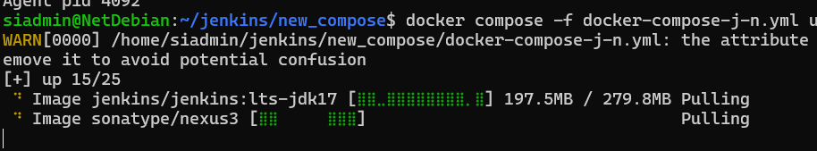

eval $(ssh-agent -s)

docker compose -f docker-compose-j-n.yml up -d

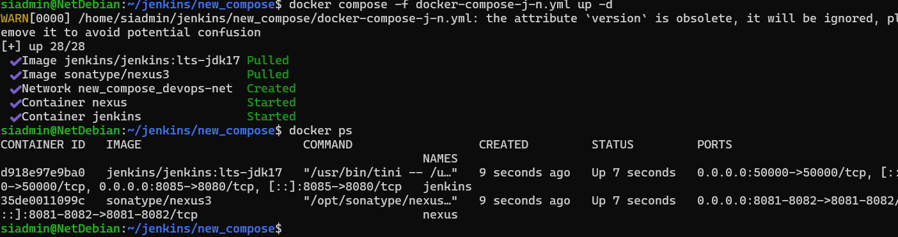

Настройка nexus

ip:

docker compose -f docker-compose-j-n.yml logs -f nexus

docker exec -it nexus cat /nexus-data/admin.password

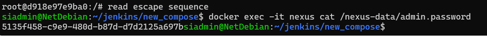

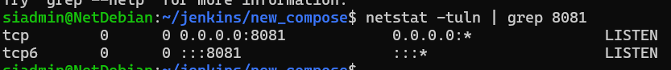

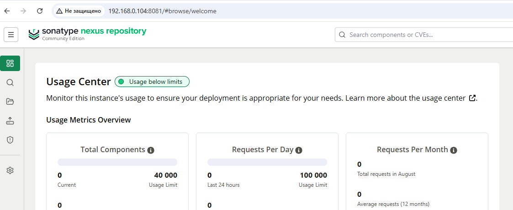

Создадим свой репозиторий для докера

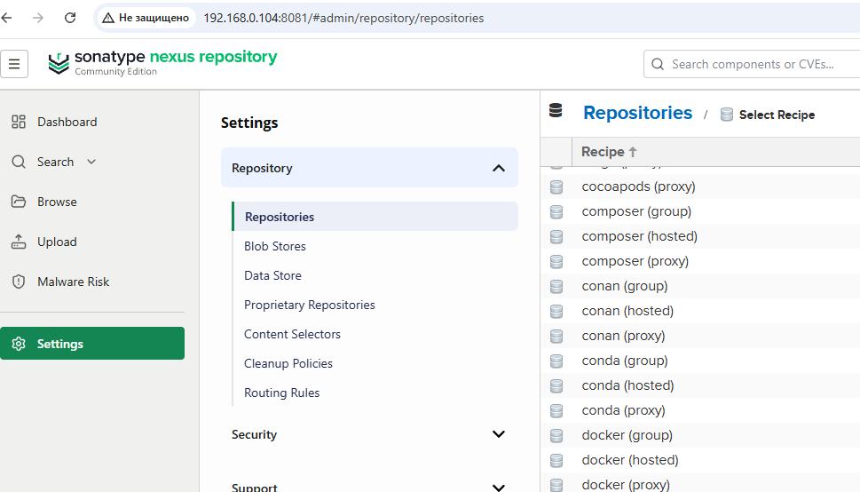

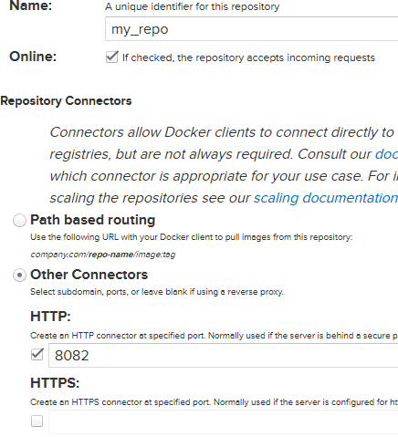

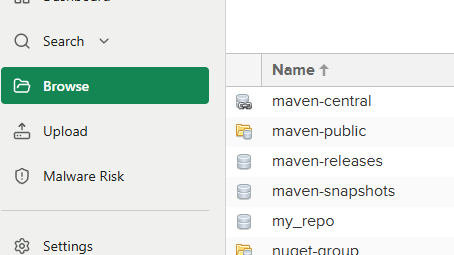

Настройка  jenkins

docker exec -it jenkins bash

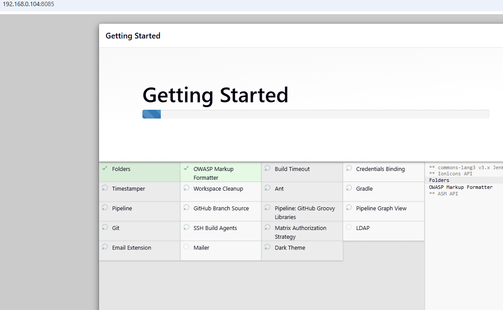

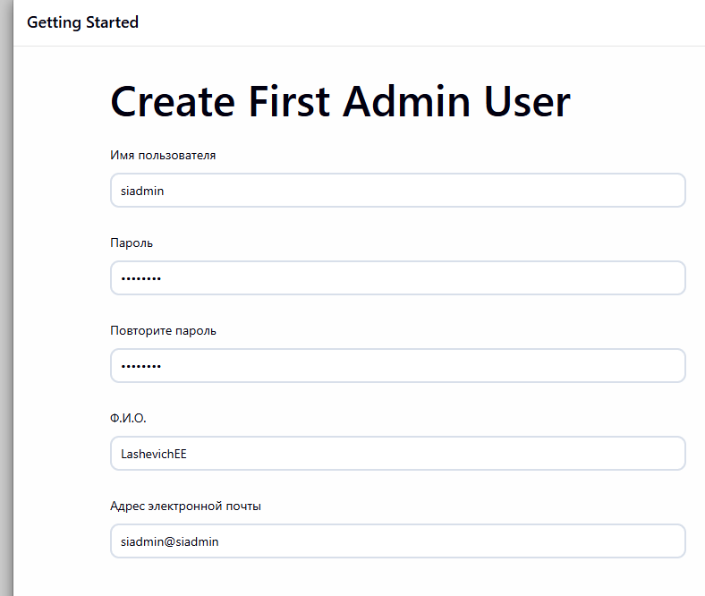

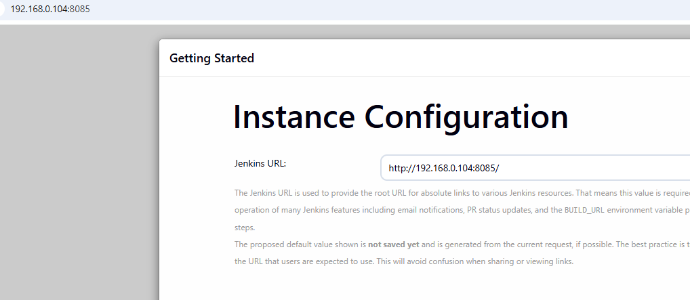

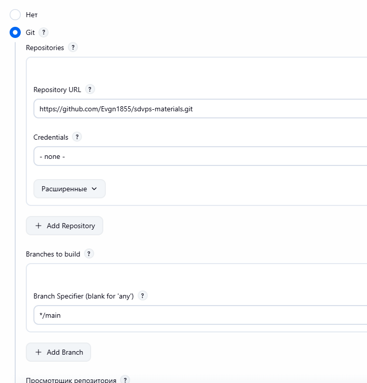

/usr/local/go/bin/go test .

docker build . -t ubuntu-bionic:8082/hello-world:v$BUILD\_NUMBER

docker login ubuntu-bionic:8082 -u admin -p admin && docker push ubuntu -bionic:8082/hello-world:v$BUILD\_NUMBER && docker logout

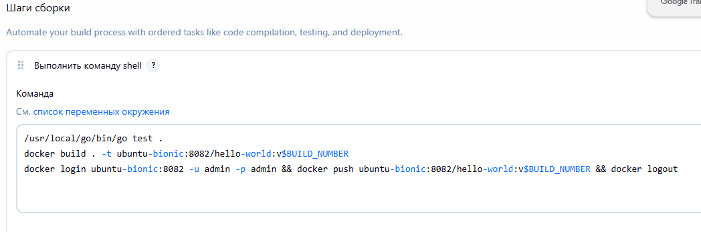

ИНСТРУКЦИЯ ДЛЯ РУЧНОЙ УСТАНОВКИ, все прописано в docer-compose-j-n.yml устанавливать не нужно

ИНСТРУКЦИЯ ДЛЯ РУЧНОЙ УСТАНОВКИ go в контейнер

docker exec -it jenkins bash

apt update && apt install wget

wget [https://go.dev/dl/go1.17.5.linux-amd64.tar.gz](https://www.google.com/url?q=https://go.dev/dl/go1.17.5.linux-amd64.tar.gz&sa=D&source=editors&ust=1787045313906804&usg=AOvVaw298MkIKngLGsLPpdB7e0gt)

tar -C /usr/local -xzf [go1.17.5.linux-amd64.tar.gz](https://www.google.com/url?q=http://go1.17.5.linux-amd64.tar.gz&sa=D&source=editors&ust=1787045313907104&usg=AOvVaw3LpNV76Q28NEXY6vbGttxC)

echo 'export PATH=$PATH:/usr/local/go/bin' | tee -a /etc/profile

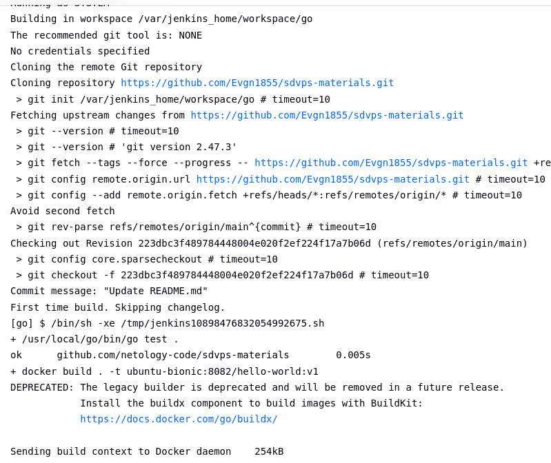

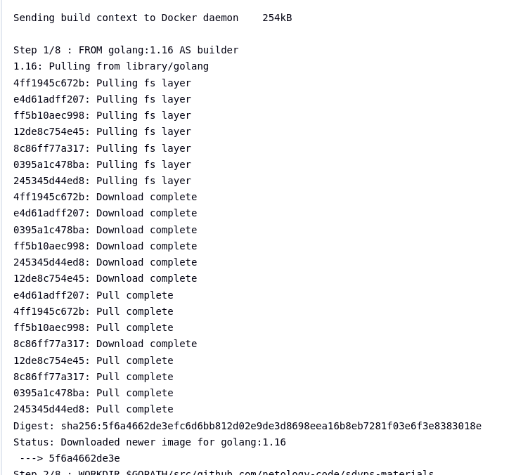

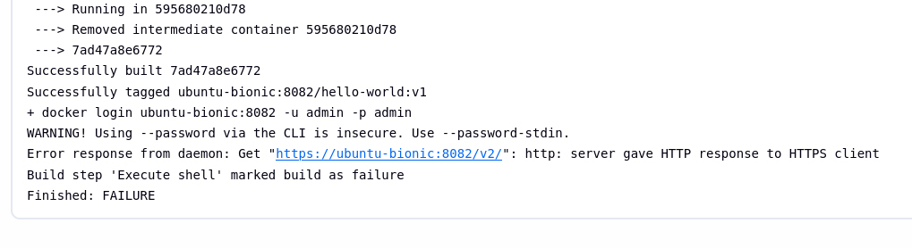

нужно прописать домен в хостовой машине

ubuntu-bionic 192.168.0.104

так же нужно поменять пароль в конфигурации на тот что указали при авторизации nexus

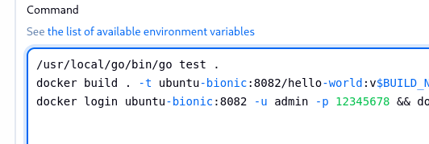

А так же что-то сделать с ssl

/etc/docker/daemon.json

Создадим необходимые директории и пропишем ВНУТРИ контейнера:

{ "insecure-registries" : \["ubuntu-bionic:8082"\]}

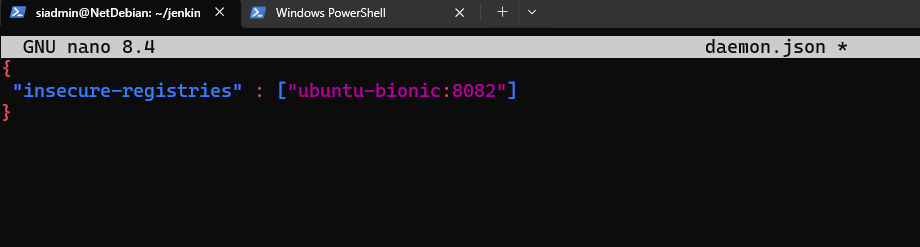

Конфиг на хосте

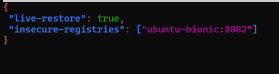

Удалить все не использованные образы

docker system prune -a --volumes

docker images

сделать копию образа для сохранения всех изменений

docker commit jenkins jenkins\_back

sudo dockerd --config-file /etc/docker/daemon.json --validate

sudo systemctl reload docker

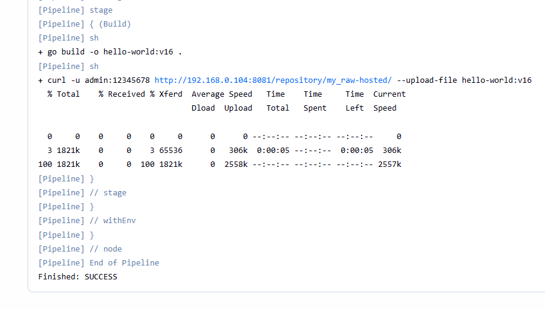

Задание 2

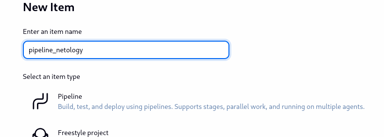

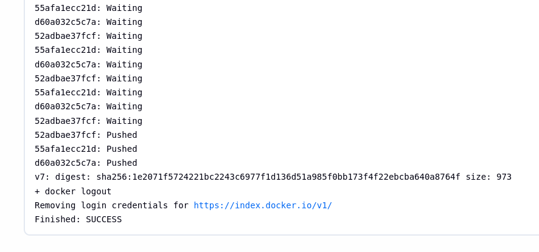

ошибка:

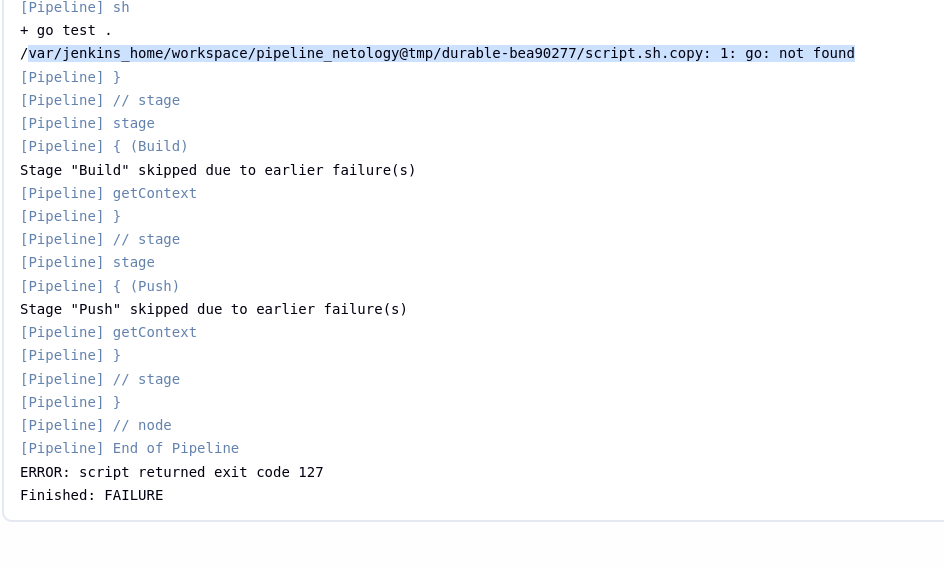

нужно явно указать путь к go в пайплане

pipeline {

 agent any

 environment {

        // Добавляем путь к Go в начало системного PATH

        PATH = "/usr/local/go/bin:${env.PATH}"

        // Если приложению нужен настроенный GOPATH, можно раскомментировать строку ниже:

        // GOPATH = "${WORKSPACE}/go"

}

 stages {

  stage('Git') {

   steps {git 'https://github.com/Evgn1855/sdvps-materials.git'}

  }

  stage('Test') {

   steps {

    sh 'go test .'

   }

  }

  stage('Build') {

   steps {

    sh 'docker build . -t ubuntu-bionic:8082/hello-world:v$BUILD\_NUMBER'

   }

  }

  stage('Push') {

   steps {

    sh 'docker login ubuntu-bionic:8082 -u admin -p 12345678 && docker push ubuntu-bionic:8082/hello-world:v$BUILD\_NUMBER && docker logout'   }

  }

 }

}

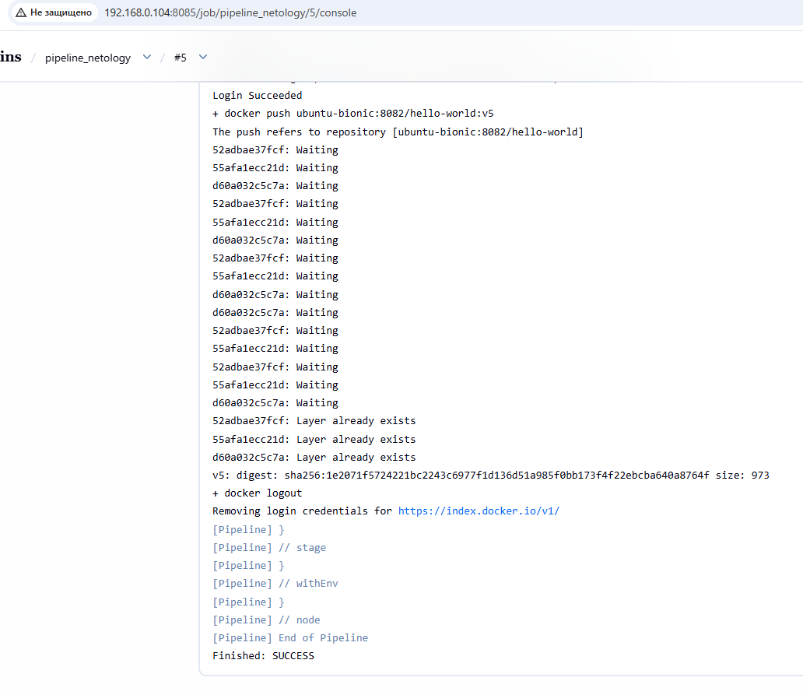

Задание 3

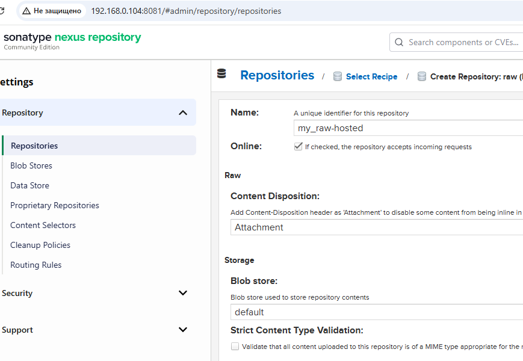

pipeline {

 agent any

 environment {

    // Добавляем путь к Go в начало системного PATH

    PATH = "/usr/local/go/bin:${env.PATH}"

    // Если приложению нужен настроенный GOPATH, можно раскомментировать строку ниже:

    // GOPATH = "${WORKSPACE}/go"

  }

 stages {

    stage('Git') {

   steps {

//ветка main а не master

        checkout(\[$class: 'GitSCM',

          branches: \[\[name: '\*/main'\]\],

          userRemoteConfigs: \[\[url: 'https://github.com/Evgn1855/sdvps-materials.git'\]\]

        \])

      }

    }

    stage('Test') {

   steps {

    sh 'go test .'

      }

    }

    stage('Build') {

   steps {

    sh 'go build -o hello-world:v$BUILD\_NUMBER .'

    sh 'curl -u admin:12345678 http://192.168.0.104:8081/repository/my\_raw-hosted/ --upload-file hello-world:v$BUILD\_NUMBER'

      }

    }

  }

}

синтаксис go:

go build -o myapp [main.go](https://www.google.com/url?q=http://main.go&sa=D&source=editors&ust=1787045313914888&usg=AOvVaw17ZEh-Z3es9fWTw-lkXjaI) - сохранит программу под именем myapp